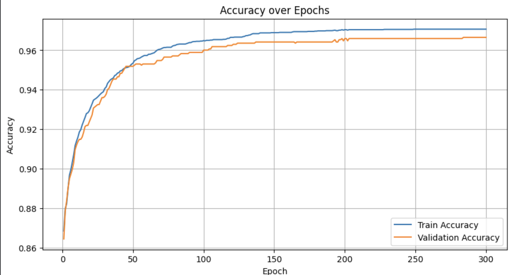
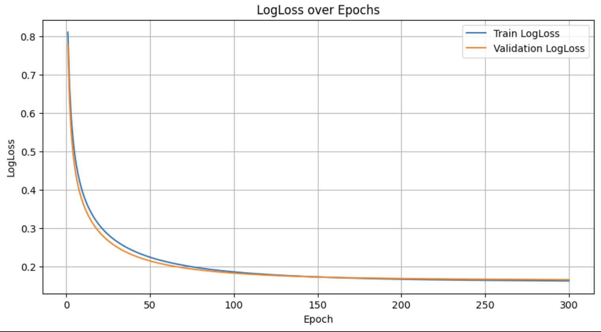
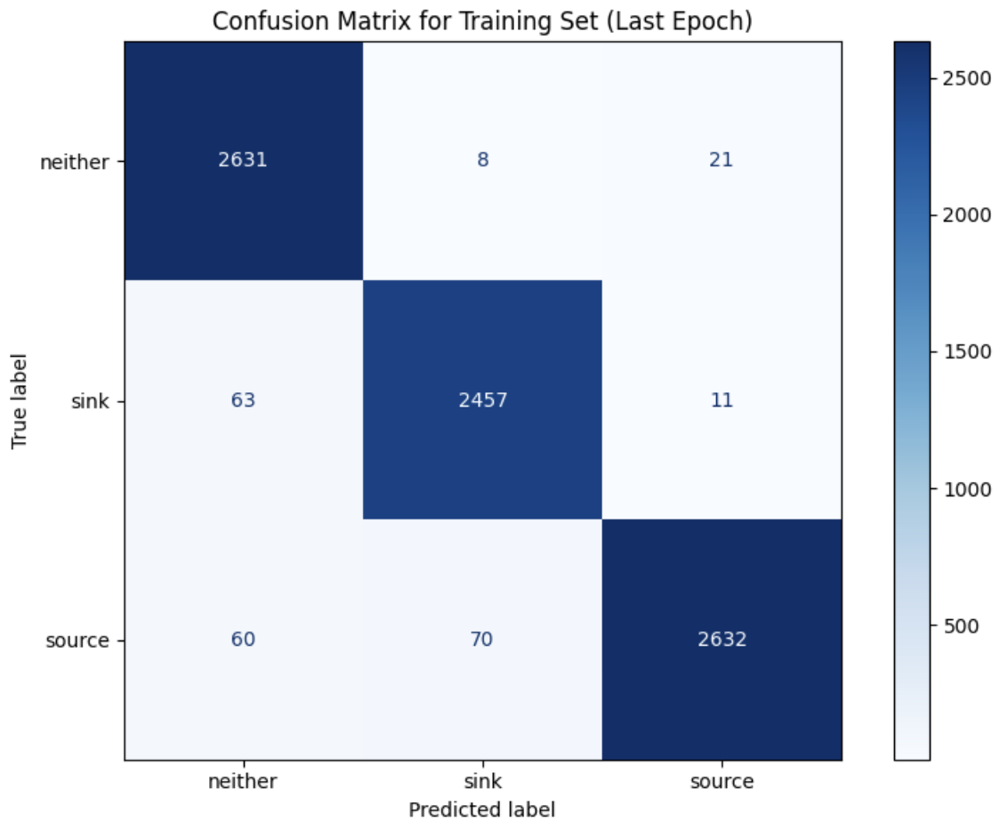
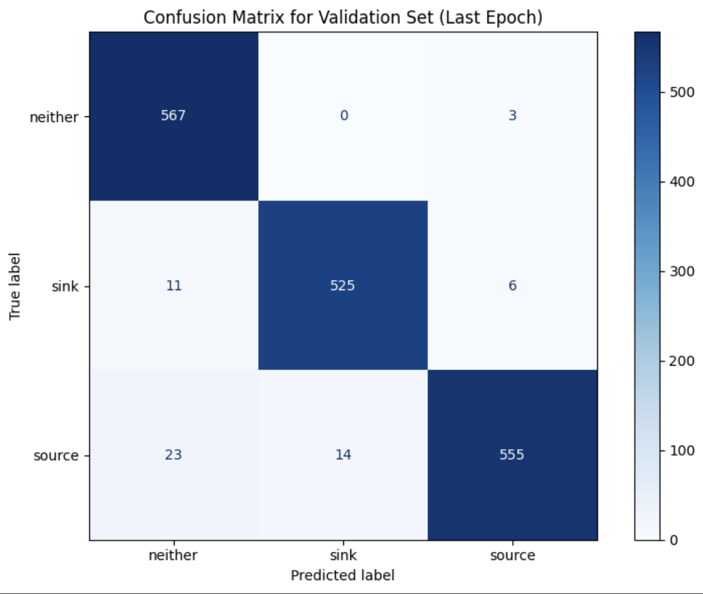

# Sources-Sinks-Classification-ML
> Android 앱 정적 분석을 위한 Source/Sink/Neither API 자동 분류 머신러닝 모델

[](https://www.python.org/)
[](https://scikit-learn.org/)
[](LICENSE)

---

## 개요

이 프로젝트는 Android 앱의 정적 분석에서 중요한 역할을 하는 **Source와 Sink API를 자동으로 분류하는 머신러닝 모델**을 구현합니다.

TF-IDF 벡터화와 SGDClassifier를 활용하여 API 경로(`api_path`)를 기반으로 세 가지 클래스를 분류합니다.

### 분류 클래스

| 클래스 | 설명 | 예시 |
|--------|------|------|
| **SOURCE** | 민감한 데이터의 출발점 | 위치정보, 연락처, 카메라 데이터 등 |
| **SINK** | 데이터가 유출될 수 있는 도착점 | 네트워크 전송, 파일 저장, 로그 출력 등 |
| **NEITHER** | Source도 Sink도 아닌 일반 API | 일반적인 유틸리티 메서드 |

---

## 주요 성능 지표
```
- 전체 정확도: 97%
- Macro Avg F1-score: 0.96
- Weighted Avg F1-score: 0.97
 과적합 없음 (Train/Val/Test 성능 일관)
```

### 클래스별 성능

| 클래스 | Precision | Recall | F1-score | Support |
|--------|-----------|--------|----------|---------|
| neither | 0.98 | 0.98 | 0.98 | 570 |
| sink | 0.96 | 0.95 | 0.96 | 543 |
| source | 0.97 | 0.95 | 0.96 | 592 |

---

## 🛠 기술 스택

- **언어**: Python 3.x
- **주요 라이브러리**:
  - `scikit-learn`: 머신러닝 모델 및 전처리
  - `pandas`: 데이터 처리
  - `matplotlib`: 시각화
  - `tqdm`: 학습 진행 상황 표시

---

## 📂 프로젝트 구조
```
Sources-Sinks-Classification-ML/
├── API_Extraction.py
├── evaluate_model.py   
├── source_sink_neither.csv        
├── tfidf_sgd_classifier_train.py
├── API_Filtering/
├── models/
│   ├── sgd_model.pkl           
│   └── tfidf_vectorizer.pkl         
├── Result/
│   ├── Accuracy_Epoch.png
│   ├── LogLoss.png
│   ├── Test_Confusion.png
│   ├── Train_Confusion.png
│   └── Validation_Confusion.png
└── README.md
```

---

## 📊 데이터셋

### 데이터 구성

- **파일명**: `source_sink_neither.csv`
- **입력 특성**: API 경로 문자열 (`api_path`)
- **출력 레이블**: `source`, `sink`, `neither`
- **총 샘플 수**: 11,362개

### 데이터 분할

| Split | Source | Sink | Neither | 합계 |
|-------|--------|------|---------|------|
| **Train (70%)** | 2,762 | 2,660 | 2,531 | 7,953 |
| **Validation (15%)** | 592 | 570 | 542 | 1,704 |
| **Test (15%)** | 592 | 570 | 543 | 1,705 |

- **Stratified Split** 적용으로 클래스 비율 유지
- **Class Balancing**: `balanced` 가중치 + Sink 클래스 1.5배 추가 가중

---

## 🔬 방법론

### 1. 데이터 전처리
```python
# 주요 전처리 단계
1. CSV 파일 로드
2. 라벨 소문자 변환 및 정규화
3. source/sink/neither만 필터링
4. Stratified train/val/test split (70/15/15)
```

### 2. 특징 추출 (TF-IDF)

- **TF-IDF Vectorizer** 사용
- **N-gram**: unigram + bigram 조합
- **Sparse Matrix** 기반 메모리 최적화
- API 문자열의 의미론적 유사성 포착

### 3. 모델 아키텍처
```python
SGDClassifier(
    loss='log_loss',            # Logistic Regression
    learning_rate='constant',   # 고정 학습률
    eta0=0.01,                  # Initial learning rate
    max_iter=1,                 # Epoch당 1회 학습
    class_weight=custom_weights # 불균형 처리
)
```

### 4. 하이퍼파라미터

| 파라미터 | 값 |
|----------|-----|
| Epochs | 300 |
| Batch Size | 128 |
| Learning Rate | 0.01 |
| Alpha (L2 정규화) | 0.0001 |
| Loss Function | log_loss (Cross-Entropy) |

### 5. 클래스 불균형 해결
```python
# Balanced class weight 계산
class_weights_balanced = compute_class_weight(
    'balanced', 
    classes=classes, 
    y=y_train
)

# Sink 클래스에 추가 가중치
class_weights_balanced['sink'] *= 1.5
```

---

## 📈 학습 결과 분석

### Accuracy over Epochs

{width=400px}


- **최종 Train Accuracy**: 97.7%
- **최종 Validation Accuracy**: 97.0%
- **수렴 시점**: ~100 epoch
- **과적합 여부**: ❌ 없음 (Train/Val 곡선 유사)

---

### LogLoss over Epochs

{width=600px}


- 초반 Loss 급감 후 안정화
- Train/Validation Loss 패턴 일관
- 확률 기반 예측 품질 우수

---

## 🎯 Confusion Matrix 분석

### Training Set (Last Epoch)



| 실제 \ 예측 | neither | sink | source |
|-------------|---------|------|--------|
| **neither** | 2631 | 8 | 21 |
| **sink** | 63 | 2457 | 11 |
| **source** | 60 | 70 | 2632 |

**학습 정확도: 97.7%**
- Neither: 98.9% (2631/2660)
- Sink: 97.1% (2457/2531)
- Source: 95.3% (2632/2762)

---

### Validation Set (Last Epoch)



| 실제 \ 예측 | neither | sink | source |
|-------------|---------|------|--------|
| **neither** | 567 | 0 | 3 |
| **sink** | 11 | 525 | 6 |
| **source** | 23 | 14 | 555 |

**검증 정확도: 97.0%**
- Neither: 99.5% (567/570)
- Sink: 96.9% (525/542)
- Source: 93.8% (555/592)

---

### Test Set (Final Evaluation)


| 실제 \ 예측 | neither | sink | source |
|-------------|---------|------|--------|
| **neither** | 556 | 3 | 11 |
| **sink** | 18 | 517 | 8 |
| **source** | 16 | 16 | 560 |

**테스트 정확도: 96.6%**

#### 클래스별 상세 분석

**Neither 클래스**
- 556개 정확 분류 (97.5%)
- 3개 → sink, 11개 → source 오분류
- 가장 안정적인 분류 성능

**Sink 클래스**
- 517개 정확 분류 (95.2%)
- 18개 → neither, 8개 → source 오분류
- 일부 neither와의 경계 혼동

**Source 클래스**
- 560개 정확 분류 (94.6%)
- 16개 → neither, 16개 → sink 오분류
- Sink와의 양방향 혼동 (기능적 유사성)

---

### 📊 Train/Val/Test 일관성 분석

| 지표 | Train | Validation | Test |
|------|-------|------------|------|
| **Overall Accuracy** | 97.7% | 97.0% | 96.6% |
| **Neither 정확도** | 98.9% | 99.5% | 97.5% |
| **Sink 정확도** | 97.1% | 96.9% | 95.2% |
| **Source 정확도** | 95.3% | 93.8% | 94.6% |


---

## 참고 자료

- [Machine-learning Approach for Classifying and Categorizing Android Sources and Sinks](https://www.ndss-symposium.org/wp-content/uploads/2017/09/10_1_1.pdf)
- [EviHunter: Identifying Digital Evidence in Android Applications](https://github.com/PASSIONLab/EviHunter)
- [Scikit-learn Documentation](https://scikit-learn.org/)

---
